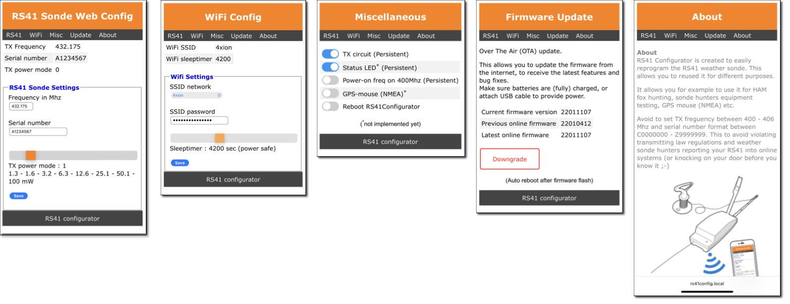

# RS41 Configurator
This project is about reusing to [Vaisala RS41](https://en.wikipedia.org/wiki/Vaisala) radiosonde.

## Introduction
RS41 Configurator allows you to reprogram the weather sonde via a browser. Give the RS41 another purpose after you've found one. You can for example use it for HAM fox hunting, sonde hunter equipment testing, antenna building and tuning, or as a GPS mouse (NMEA) etc.

### Caution!
Avoid to set TX freguency between 400 - 406 Mhz and serial number format between C0000000 - Z9999999. This to avoid violating transmitting law regulations and weather sonde hunters reporting your RS41 into online systems (or knocking on your door before you know it ;-)

## Impression
Once you have modified the RS41 and flashed the RS41Configurator firmware, you can reconfigure the radiosonde persistantly. This can be done through a browser on you mobile phone or computer, via an ad-hoc or your selected WiFi network.

## Building

### Hardware

### Software

\>>> Work in progress, check again later <<<